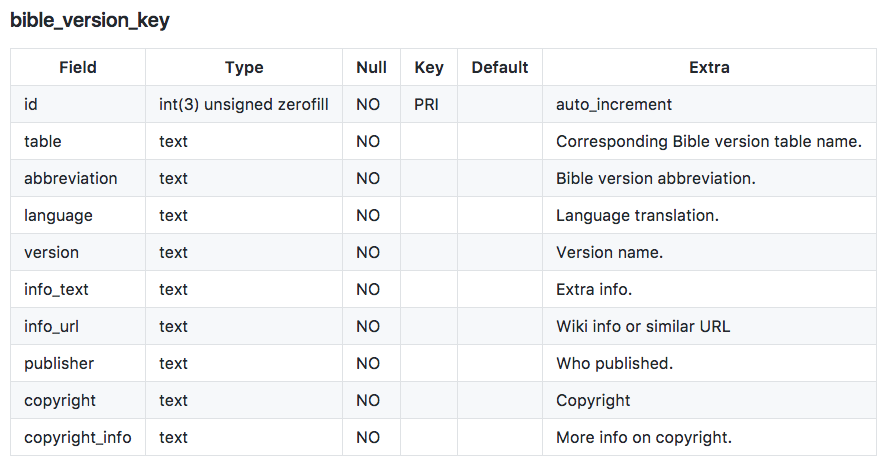
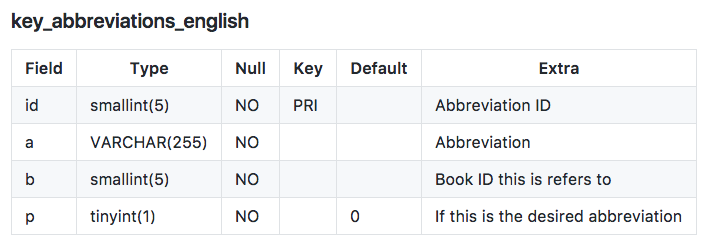
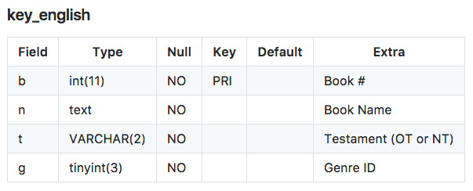
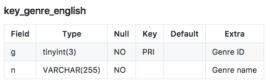
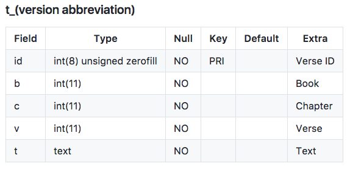

# Capstone Project
NLP_Capstone Project 
[Here,](https://public.tableau.com/views/NLPOnTheBible/NLPOnTheBible?:embed=y&:useGuest=true&:display_count=yes&:origin=viz_share_link)  you will find the Tableau Presentation. 
 

# Content Layout 

Please read below for the details of the contents found in this folder. The contents are organized with The Data Science Process in mind.  

- [Problem Statement](#problem-statement)
- [Data Source](#data-source)
- [Data Exploration](#data-exploration)
- [In-depth Analysis](#in-depth-analysis)
- [Results](#results)

# Problem statement 

Is it possible to accurately classify a verse in its respective genre? Therefore, what is the optimal machine learning method to identify a text with similar content from a given corpus? 

**Short term goal:** The short term goal of this project is to accurately be able to classify a verse,  in this case from a given version of The Bible,  to its respective genre. 

**Long term goal:** The long term goal of this project is to build a recommender that takes in a verse as input and recommends a similar passage from elsewhere in the Bible. This is similar to indexing by word, except applied to an entire verse.  

**Broader application:** This project is developed with the larger application of Natural Language Processing (NLP) in mind. Specifically, in tasks that require word parsing. Using machine learning to identify similar context within a corpus has an impactful application. Therefore, this project aims to experiment with NLP using one of the most widely translated text in the world, The Bible. 

# Data Source

The data for this project is sourced from Kaggle by this account. Details such as context, content, and pre-processed [CSVs](datasets/) are also gathered from the account. Included below are the original formats by which the tables were imported prior to being adjusted in my exploration following this section. 

# Data Exploration 

The following notebook reads in the provided data and explores its contents. 
- [Primary Data Exploration Notebook](./1.0_eda_initial_exploration.ipynb)

The notebook below combines different features of the original data frame for the purpose of answering the problem statement. 
- [Feature Engineering Notebook](./2.1_preprocessing_feature_engineering.ipynb)

The feature engineered data frames are exported into CSV and can be found in the folder [my_datasets](my_datasets/)

- [American Standard Version](./my_datasets/asv_genre_text.csv)
- [Bible in Basic English](./my_datasets/bbe_genre_text.csv)
- [King James Version](./my_datasets/kjv_genre_text.csv)
- [Webster’s Bible](./my_datasets/wbt_genre_text.csv)
- [World English Bible](./my_datasets/web_genre_text.csv)
- [Young’s Literal Translation](./my_datasets/ylt_genre_text.csv)

# In-depth Analysis 

Following the exploration process, I started by using models such as Logistic Regression as well as Naive Bayes each of the six Bible versions listed. 

I explored two different kinds of word vectorizers. I started by using Term-Frequency-Inverse-Document-Frequency(TFIDF) vectorizer. 

I then used Doc2Vec to vectorizer in order to generate vectors for the verses. I use [this](https://towardsdatascience.com/multi-class-text-classification-with-doc2vec-logistic-regression-9da9947b43f4) blog as a reference to help me with the verse pre-processing. Below is the list of the versions and their respective model notebooks. 

- [American Standard Version](/3.1_modeling_asv_text.ipynb)
- [Bible in Basic English](/3.2_modeling_bbe_text.ipynb)
- [King James Version](/3.0_modeling_kjv_text.ipynb)
- [Webster’s Bible](/3.3_modeling_wbt_text.ipynb)
- [World English Bible](/3.4_modeling_web_text.ipynb)
- [Young’s Literal Translation](/3.5_modeling_ylt_text.ipynb)

Here is a markdown table to use as a reference for the genre keys. 

| g     | n               |
|---    |-------------    |
| 1     | Law             |
| 2     | History         |
| 3     | Wisdom          |
| 4     | Prophets        |
| 5     | Gospels         |
| 6     | Acts            |
| 7     | Epistles        |
| 8     | Apocalyptic     |

# Results 

Metrics such as accuracy score and f1 score were used In order to evaluate the models. The scores for each model are also found in the notebooks listed below. 

- [American Standard Version](/3.1_modeling_asv_text.ipynb)
- [Bible in Basic English](/3.2_modeling_bbe_text.ipynb)
- [King James Version](/3.0_modeling_kjv_text.ipynb)
- [Webster’s Bible](/3.3_modeling_wbt_text.ipynb)
- [World English Bible](/3.4_modeling_web_text.ipynb)
- [Young’s Literal Translation](/3.5_modeling_ylt_text.ipynb)

Included is the [powerpoint](/Capstone_PPT.pdf) detailing my most recent findings. 

# Moving forward 

In addition to the findings above, I plan to implement the following short-term and long-term goals to help better answer the problem statement. 

- Hyper tuning Naive Bayes and Logistic Regression in order to experiment with multiple parameters. 
- Implement [regex](https://www.rexegg.com/regex-quickstart.html) prior to vectorizing 
- Test each bible version against the rest. 
- Apply additional models including Random Forests, Adaboost, and Support Vector Machines SVMs
- Concatenate all the versions and test against a different source of text with the same 8 class genres.
- Implement a  content-based Recommender based on the best classification performance above 
- Utilize a Graphic User Interface (GUI) tool to easily be able to input verses in a manner that will  recommend similar context in a user-friendly environment 
- Based on the performance of models and techniques above, expand the genre keys as well as versions to train against a new set of genres. 
